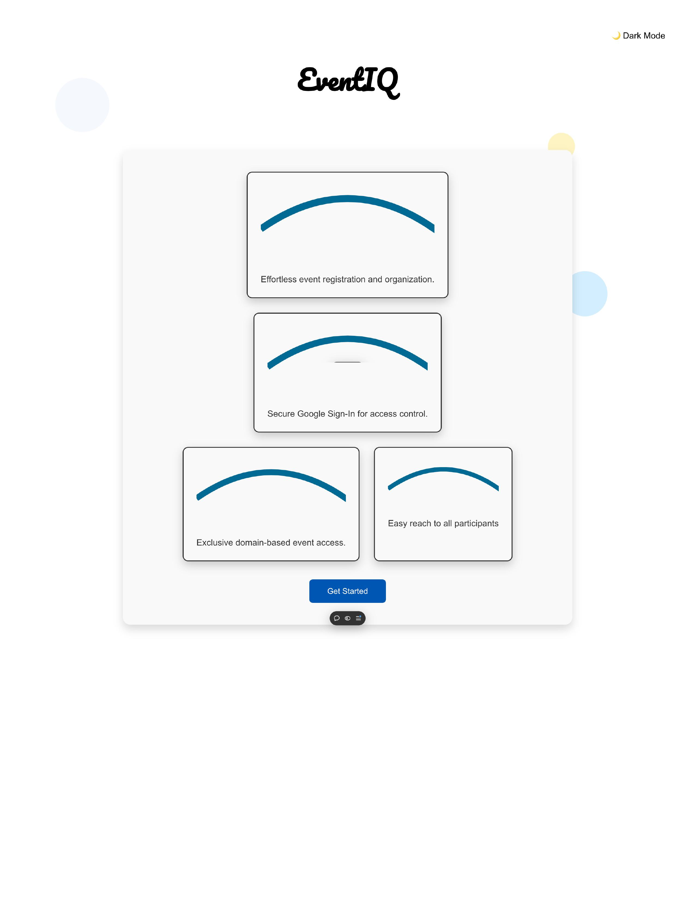

# EventiQ
An event app that is highly secure, scalable, and fun to use.
Link to app: https://eventiq.tech

## Inspiration ✍️

1. Currently people and various institutions use google forms for many of their event registerations.🤔

=> I found this method ★(PROBLEM)★
1. Very repetitive 🙈
2. Difficult to reach out to participant for change of event details.💁🏽
3. Participant do not fully engage with the events before registering in google forms unless event posted elsewhere.😔
4. Organizers and Participants are unable to easy access and store upcoming and past events.😩

## Real Inspiration ✍️

2. Came from my college experience, how different event on campus used google forms to RSVP. This method was sometimes hard for me to remind myself to attend them. 😱
3. In addition, I wish I had a place/hub where all the event I attended in college were stored in one place so I can look back on it.😶‍🌫️

## This app ★(SOLUTION)★ ✍️

1. Secure and reliable sign in through google sign-on.😎
2. Participants only view events from organizers with same email domain, for example, .augustana.edu events would only be viewed by .augustana.edu emails.😃
3. Organizers can reach out to registered participants through gmail for any event changes or updates.👅
4. Participants and Organizers can keep track of upcoming events and past events.💪🏽

This is how the home page looks:👀

